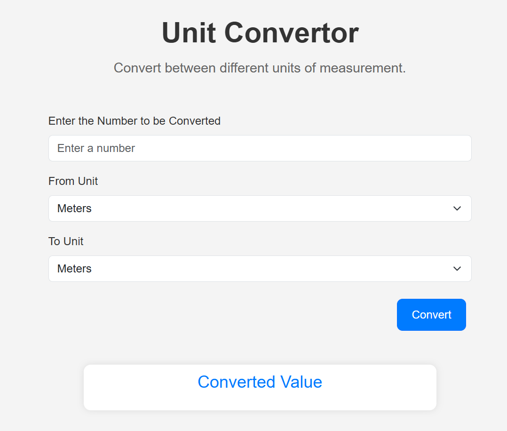

# Unit-Convertor
A sleek, responsive web app for effortless length unit conversions (meters, kilometers, centimeters, millimeters, feet, inches, yards). Powered by HTML5, CSS3, and JavaScript, it delivers instant results with a modern UI and robust input validation. Ideal for quick, precise conversions. Open to contributions and new feature ideas! 🚀

## Features

- Converts between multiple length units: meters, kilometers, centimeters, millimeters, feet, inches, and yards
- Clean and responsive user interface
- Real-time conversion with instant results
- Input validation to ensure valid numbers
- Results displayed with two decimal places precision

## Technologies Used

- HTML5
- CSS3
- JavaScript
- Responsive design with a clean, modern look

## Project Structure

```
unit-converter/
├── index.html      # Main HTML file containing the structure
├── style.css       # CSS file for styling the application
├── script.js       # JavaScript file for conversion logic
└── README.md       # Project documentation
```

## Installation

1. Clone the repository:
```bash
git clone https://github.com/your-username/unit-converter.git
```

2. Navigate to the project directory:
```bash
cd unit-converter
```

3. Open `index.html` in your preferred web browser:
- You can double-click the file, or
- Use a local server (e.g., Live Server extension in VS Code)

## Usage

1. Enter a numerical value in the input field
2. Select the unit you want to convert from
3. Select the unit you want to convert to
4. Click the "Convert" button
5. View the converted value displayed below

## Screenshots



## Contributing

Contributions are welcome! Please follow these steps:

1. Fork the repository
2. Create a new branch (`git checkout -b feature/your-feature`)
3. Make your changes
4. Commit your changes (`git commit -m 'Add your feature'`)
5. Push to the branch (`git push origin feature/your-feature`)
6. Open a Pull Request


## Future Improvements

- Add more unit types (e.g., weight, temperature, volume)
- Implement keyboard support for conversions
- Add unit conversion history
- Include dark mode toggle
- Add more precise conversion options

## Contact

For any questions or suggestions, please open an issue or contact me at Samhith06@gmail.com.
